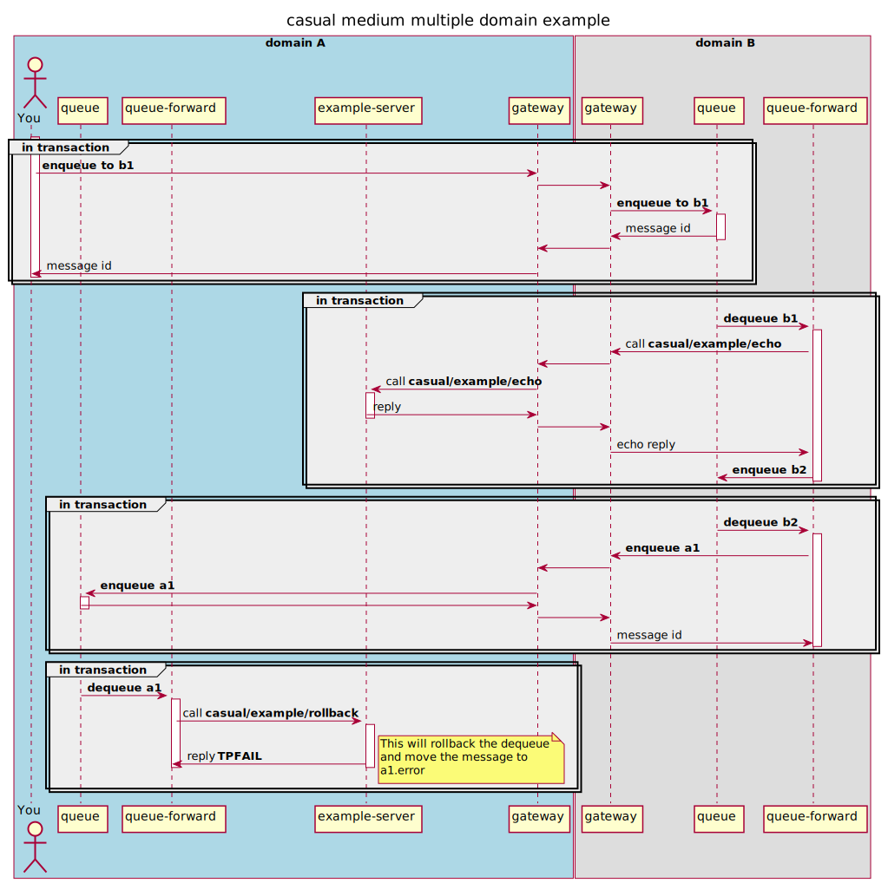

# multiple domain example

## objective

Explore:
* queue
   * enqueue
   * dequeue 
   * forward-service
   * forward-queue 
* The abillity of casual to discover resources in remote domains.

We'll set up two domains, **A** and **B**. 
* From within **A** we'll enqueue a message to a queue in **B**. 
* In **B**, a queue-service forward will dequeue the message and call a service in **A** and the reply is enqueued in another queue in **B**.
* in **B**, a queue-queue forward will dequeue the reply and enqueue it at a queue in **A**.
A queue service forward dequeues the message and calls a service that will abort the transaction, hence the message is moved 
to the corresponding error queue.


### diagram

A simplified sequence diagram on what's going on (discovery and transaction related activity is omitted)




## prerequisites

See [domain example]( ../readme.md)


## create domains

Create a directory where you want your domains to "live".

_In production you probably want to have a dedicated user for each domain and just use the "domain-user" home directory as the domain root_

The following will be used in this example.

```
$ mkdir -p $HOME/casual/example/domain/multiple
```
    
Copy the domains setup from the example:

```
$ cp -r $CASUAL_HOME/documentation/example/domain/multiple/* $HOME/casual/example/domain/multiple/
```

### configuration

Each domain has it's configuration in `$CASUAL_DOMAIN_HOME/configuration/domain.yaml`. In our example these will be located at:

* `$HOME/casual/example/domain/multiple/A/configuration/domain.yaml`
* `$HOME/casual/example/domain/multiple/B/configuration/domain.yaml`

_The environment variable_ `CASUAL_DOMAIN_HOME` _is the only thing that dictates which domain you're using and working with_

 * [A/configuration/domain.yaml](A/configuration/domain.yaml)    
 * [B/configuration/domain.yaml](B/configuration/domain.yaml) 


If you chose another base directore for this example, please update the following files so they corresponds with your choice
 
 * [A/domain.env](A/domain.env)    
 * [B/domain.env](B/domain.env) 
 

## start A

In the terminal for A.   

### prepare

Make sure the required environment settings are sourced.

*You only have to do this once.*
 
```
A$ cd $HOME/casual/example/domain/multiple/A
A$ source domain.env
```

### boot

We provide our configuration for the domain:

```
A$ casual domain --boot configuration/domain.yaml
``` 

    
## start B

In the terminal for B.

### prepare

```
B$ cd $HOME/casual/example/domain/multiple/B
B$ source domain.env
```
### boot

We provide our configuration for the domain:

```
B$ casual domain --boot configuration/domain.yaml
```


## interact with the setup


### current state

View current state in the two domains.

#### domain A

List connections:

```
A$ casual gateway --list-connections 
name  id                                group     bound  local            peer             created                         
----  --------------------------------  --------  -----  ---------------  ---------------  --------------------------------
B     c92c58fbcf7242139446e1618a2eec0f  outbound  out    127.0.0.1:61973  127.0.0.1:7772   2021-10-23T13:16:54.286028+02:00
B     c92c58fbcf7242139446e1618a2eec0f  inbound   in     127.0.0.1:7771   127.0.0.1:61972  2021-10-23T13:16:52.289561+02:00
```

We have one inbound and one outbound connection to `B`.

List services:

```
A$ casual service --list-services 
name                                   category  mode  timeout   contract  I  C  AT        min       max       P  PAT       RI  RC  last
-------------------------------------  --------  ----  --------  --------  -  -  --------  --------  --------  -  --------  --  --  ----
casual/example/advertised/echo         example   join  0.000000    linger  1  0  0.000000  0.000000  0.000000  0  0.000000   0   0  -   
casual/example/conversation            example   join  0.000000    linger  1  0  0.000000  0.000000  0.000000  0  0.000000   0   0  -   
casual/example/domain/echo/A           example   join  0.000000    linger  1  0  0.000000  0.000000  0.000000  0  0.000000   0   0  -   
casual/example/domain/name             example   join  0.000000    linger  1  0  0.000000  0.000000  0.000000  0  0.000000   0   0  -   
casual/example/echo                    example   join  0.000000    linger  1  0  0.000000  0.000000  0.000000  0  0.000000   0   0  -   
casual/example/error/system            example   join  0.000000    linger  1  0  0.000000  0.000000  0.000000  0  0.000000   0   0  -   
casual/example/forward                 example   join  0.000000    linger  1  0  0.000000  0.000000  0.000000  0  0.000000   0   0  -   
casual/example/forward/echo            example   auto  0.000000    linger  1  0  0.000000  0.000000  0.000000  0  0.000000   0   0  -   
casual/example/forward/join/echo       example   join  0.000000    linger  1  0  0.000000  0.000000  0.000000  0  0.000000   0   0  -   
casual/example/lowercase               example   join  0.000000    linger  1  0  0.000000  0.000000  0.000000  0  0.000000   0   0  -   
casual/example/rollback                example   join  0.000000    linger  1  0  0.000000  0.000000  0.000000  0  0.000000   0   0  -   
casual/example/sink                    example   join  0.000000    linger  1  0  0.000000  0.000000  0.000000  0  0.000000   0   0  -   
casual/example/sleep                   example   join  0.000000    linger  1  0  0.000000  0.000000  0.000000  0  0.000000   0   0  -   
casual/example/terminate               example   join  0.000000    linger  1  0  0.000000  0.000000  0.000000  0  0.000000   0   0  -   
casual/example/uppercase               example   join  0.000000    linger  1  0  0.000000  0.000000  0.000000  0  0.000000   0   0  -   
casual/example/work                    example   join  0.000000    linger  1  0  0.000000  0.000000  0.000000  0  0.000000   0   0  -   
```


`casual/example/echo` and `casual/example/rollback` is advertised from one **local** instance, and no one has requested the services yet.


List queue information:

```
A$ casual queue --list-queues 
name      group  rc  rd        count  size  avg  EQ  DQ  UC  last
--------  -----  --  --------  -----  ----  ---  --  --  --  ----
a1        A       0  0.000000      0     0    0   0   0   0  -   
a2        A       0  0.000000      0     0    0   0   0   0  -   
a1.error  A       0  0.000000      0     0    0   0   0   0  -   
a2.error  A       0  0.000000      0     0    0   0   0   0  -   
```

```
$ casual queue --list-forward-services 
alias  group      source  target                   reply  delay  CI  I  commits  rollbacks  last
-----  ---------  ------  -----------------------  -----  -----  --  -  -------  ---------  ----
a1     forward-A  a1      casual/example/rollback  -          -  1   1        0          0  -   
```

#### domain B

List connections:

```
B$ casual gateway --list-connections 
name  id                                group     bound  local            peer             created                         
----  --------------------------------  --------  -----  ---------------  ---------------  --------------------------------
A     1beb85a07678410aa39de492db9f292f  outbound  out    127.0.0.1:61972  127.0.0.1:7771   2021-10-23T13:16:52.289521+02:00
A     1beb85a07678410aa39de492db9f292f  inbound   in     127.0.0.1:7772   127.0.0.1:61973  2021-10-23T13:16:54.285984+02:00
```

We have one inbound and one outbound connection to `A`.

List services:

```
B$ casual service --list-services 
name  category  mode  timeout  contract  I  C  AT  min  max  P  PAT  RI  RC  last
----  --------  ----  -------  --------  -  -  --  ---  ---  -  ---  --  --  ----
```

`casual/example/echo` is not yet known in this domain.

List queue information:

```
B$ casual queue --list-queues 
name      group  rc  rd        count  size  avg  EQ  DQ  UC  last
--------  -----  --  --------  -----  ----  ---  --  --  --  ----
b1        B       0  0.000000      0     0    0   0   0   0  -   
b2        B       0  0.000000      0     0    0   0   0   0  -   
b3        B       0  0.000000      0     0    0   0   0   0  -   
b1.error  B       0  0.000000      0     0    0   0   0   0  -   
b2.error  B       0  0.000000      0     0    0   0   0   0  -   
b3.error  B       0  0.000000      0     0    0   0   0   0  -    
```

```
$ casual queue --list-forward-services 
alias  group      source  target               reply  delay     CI  I  commits  rollbacks  last
-----  ---------  ------  -------------------  -----  --------  --  -  -------  ---------  ----
b1     forward-B  b1      casual/example/echo  b2     0.000000  1   1        0          0  -   
```

```
$ casual queue --list-forward-queues   
alias  group      source  target  delay     CI  I  commits  rollbacks  last
-----  ---------  ------  ------  --------  --  -  -------  ---------  ----
b2     forward-B  b2      a1      0.000000  0   0        0          0  -   
```


### enqueue a message

In `A`, enqueue some characters to `b1` that is located in `B`

```
A$ echo "test" | casual buffer --compose | casual queue --enqueue b1
bec3b4b3cccd4f3b89faee970518ab7d
```

The message should be enqueued to `a1` and then dequeued and rollbacked, hence end up in `a1.error` pretty much directly.

```
A$ casual queue --list-queues 
name      group  rc  rd        count  size  avg  EQ  DQ  UC  last                            
--------  -----  --  --------  -----  ----  ---  --  --  --  --------------------------------
a1        A       0  0.000000      0     0    0   1   1   0  2021-10-24T17:38:48.356025+02:00
a2        A       0  0.000000      0     0    0   0   0   0  -                               
a1.error  A       0  0.000000      1     5    5   1   0   0  2021-10-24T17:38:48.356025+02:00
a2.error  A       0  0.000000      0     0    0   0   0   0  -                      


The service `casual/example/echo` should be requested once (the call from remote `B`).
The service `casual/example/rollback` should be requested once from the forward in this domain.

```
A$ casual service --list-services 
name                                 category  mode  timeout   contract  I  C  AT        min       max       P  PAT       RI  RC  last                            
-----------------------------------  --------  ----  --------  --------  -  -  --------  --------  --------  -  --------  --  --  --------------------------------
casual/example/advertised/echo       example   join  0.000000    linger  1  0  0.000000  0.000000  0.000000  0  0.000000   0   0  -                               
casual/example/conversation          example   join  0.000000    linger  1  0  0.000000  0.000000  0.000000  0  0.000000   0   0  -                               
casual/example/domain/echo/A         example   join  0.000000    linger  1  0  0.000000  0.000000  0.000000  0  0.000000   0   0  -                               
casual/example/domain/name           example   join  0.000000    linger  1  0  0.000000  0.000000  0.000000  0  0.000000   0   0  -                               
casual/example/echo                  example   join  0.000000    linger  1  1  0.000090  0.000090  0.000090  0  0.000000   0   0  2021-10-24T17:38:48.354110+02:00
casual/example/error/system          example   join  0.000000    linger  1  0  0.000000  0.000000  0.000000  0  0.000000   0   0  -                               
casual/example/forward               example   join  0.000000    linger  1  0  0.000000  0.000000  0.000000  0  0.000000   0   0  -                               
casual/example/forward/echo          example   auto  0.000000    linger  1  0  0.000000  0.000000  0.000000  0  0.000000   0   0  -                               
casual/example/forward/join/echo     example   join  0.000000    linger  1  0  0.000000  0.000000  0.000000  0  0.000000   0   0  -                               
casual/example/lowercase             example   join  0.000000    linger  1  0  0.000000  0.000000  0.000000  0  0.000000   0   0  -                               
casual/example/rollback              example   join  0.000000    linger  1  1  0.000033  0.000033  0.000033  0  0.000000   0   0  2021-10-24T17:38:48.357365+02:00
casual/example/sink                  example   join  0.000000    linger  1  0  0.000000  0.000000  0.000000  0  0.000000   0   0  -                               
casual/example/sleep                 example   join  0.000000    linger  1  0  0.000000  0.000000  0.000000  0  0.000000   0   0  -                               
casual/example/terminate             example   join  0.000000    linger  1  0  0.000000  0.000000  0.000000  0  0.000000   0   0  -                               
casual/example/uppercase             example   join  0.000000    linger  1  0  0.000000  0.000000  0.000000  0  0.000000   0   0  -                               
casual/example/work                  example   join  0.000000    linger  1  0  0.000000  0.000000  0.000000  0  0.000000   0   0  -                                   
```


In `B`, `casual/example/echo` should be known with no local instances:

```
B$ casual service --list-services 
name                 category  mode  timeout   contract  I  C  AT        min       max       P  PAT       RI  RC  last                            
-------------------  --------  ----  --------  --------  -  -  --------  --------  --------  -  --------  --  --  --------------------------------
casual/example/echo  example   join  0.000000    linger  0  1  0.000648  0.000648  0.000648  0  0.000000   1   1  2021-10-24T17:38:48.354246+02:00
```


