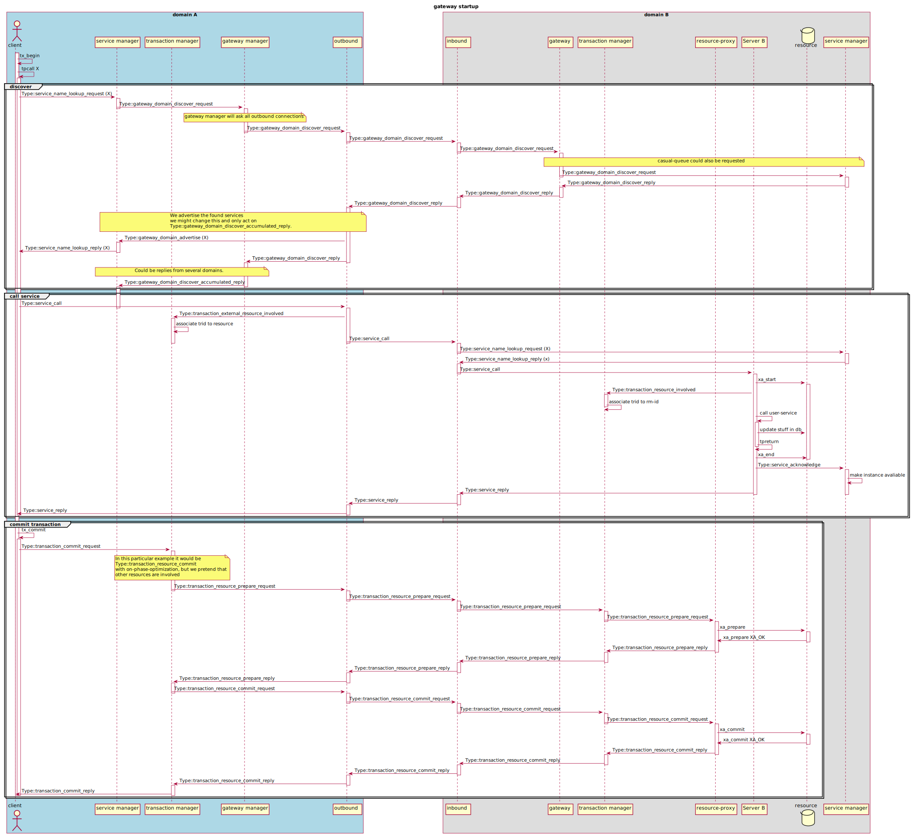

# Middleware

The main product in the casual suite.

## Table of Contents

- [What is casual-middleware?](#markdown-header-what-is-casual-middleware)
- [Objectives](#markdown-header-objectives)
- [Why casual?](#markdown-header-why-casual)
- [Structure](#markdown-header-structure)
  * [Administration](#markdown-header-administration)
  * [Binding](#markdown-header-binding)
  * [Buffer](#markdown-header-buffer)
  * [Common](#markdown-header-common)
    + [Global state](#markdown-header-global-state)
    + [Threads](#markdown-header-threads)
    + [Redesign](#markdown-header-redesign)
    + [Log](#markdown-header-log)
  * [Configuration](#markdown-header-configuration)
  * [Domain](#markdown-header-domain)
    + [domain-manager](#markdown-header-domain-manager)
    + [domain-delay](#markdown-header-domain-delay)
  * [Gateway](#markdown-header-gateway)
    + [Interdomain semantics](#markdown-header-interdomain-semantics)
      - [Startup](#markdown-header-startup)
      - [Call absent service](#markdown-header-call-absent-service)
  * [Plugin](#markdown-header-plugin)
  * [Queue](#markdown-header-queue)
  * [Service](#markdown-header-service)
  * [Serviceframework](#markdown-header-serviceframework)
  * [Transaction](#markdown-header-transaction)
    + [Two domains with one resource each](#markdown-header-two-domains-with-one-resource-each)

## What is casual-middleware?

It is a SOA platform and Distributed transaction manager.

It implements, and conforms to the following specifications:

* [XATMI specification](http://pubs.opengroup.org/onlinepubs/9694999399/toc.pdf)
* [XA specification](http://pubs.opengroup.org/onlinepubs/009680699/toc.pdf)
* [TX specification](http://pubs.opengroup.org/onlinepubs/9694999599/toc.pdf)

## Objectives

* As little configuration as possible, since we believe that enterprises are in desperate need of reduced complexity.
* Performance should be good enough, hence make casual a viable choice when migrating from other XATMI implementations.
* Keep the cold cold, and the hot hot. To enable over provisioning, hence let the OS take care of scheduling.
* Productive. That is, the opposite of many of todays "application servers".

## Why casual?

* The semantics are simple and easy to reason about.
* Services (servers) can be distributed to fit any deployment needs.
* Asynchronous pattern gives massive concurrency without the hassle of threads.
* Using single threaded servers gives linear scalability and execution encapsulation.
* Services can be exposed as REST services (JSONP, SOAP…), non intrusive out of the box\*.
* Built on specifications that is proven to work for large scale applications with high performance demand.

\*) If the service is implemented via the C++ abstraction layer.

## Structure

`casual-middlware` consist of the following modules.

### Administration

Read more in [`administration/documentation/`](./administration/documentation/api.md).

### Binding

Responsible for bindings to other languages.

The goal is to have bindings for at least the following languages:

* Python
* Java
* COBOL

As we do not support running casual on Windows, and we don't have any plans
for doing so in the near future, .NET bindings is only going to happen if
we target .NET core for linux and OS X.

### Buffer

Provides C-abstractions to fill - and read data into and from XATMI-buffers allocated with `tpalloc()`.

More documentation is available in [`buffer/`](./buffer/README.md).

### Common

Functionality that is common and in some way shared with other modules. 

#### Global state

Since the XATMI spec is plain C-functions we need to keep global state.

Every part that needs global state implements a 'context', which is just a singleton. 
With this we can keep the state together with the implementation.

We could, in the future, lock access to these 'context' if we want to support user using XATMI 
functions from different threads. But since we're not big fans of threads in genereal, especially in
business code, this is highly unlikely to happen.

*The user can use as many threads as he or she wants, as long as XATMI-interaction is done from the main thread*

#### Threads 

We try to avoid threads as much as possible, since it's way to error prone and hard to reason about.

We only use threads in mockup for unittest, and we'll probably use threads in the gateway.

Hence, very few parts are thread safe.

#### Redesign

The following parts needs a redesign

* call
* transaction
* server

Fredriks intention was that these should and could be isolated and not know of each other, at least no
circular dependencies. He was wrong... 

As of now, there is no clear responsibillity between these. And if it's not possible to make it so, we
should merge these into one 'context', so it at least is clear from the outside. 

#### Log

We are confident that a hierarchic log system doesn't really work on most systems in practice. Either 
you don't get the logs you want, or you get way too much logs.

Read more in [`common/documentation/`](./common/documentation/log.md).

### Configuration

Read more in [`configuration/example/`](./configuration/example/README.md) for configuration examples.

### Domain

Responsible for a `casual-domain`. Boots all the other managers and user provided servers.

#### domain-manager

* responsible to handle all configuration.
* handle the lifecycle of every process in the domain (not counting grand-children).

#### domain-delay

Delays a message for reqeusted time before it is passed to the destination.

Can be, and is, used for "active sleep". That is, some module waits for something to be ready and instead of doing 
a sleep for some time, it sends a message to *delay* and keep running the message loop, hence act as normal and no
special corner cases is needed. When the delay has passed, the module is invoked with the message and dispatched to
a suitable handle (exactly as any other invocation)

### Gateway

Responsible for communications with other domains.

Read more about the available API in [`gateway/documentation/api.md`](./gateway/documentation/api.md) and more about
the protocol in [`gateway/documentation/protocol.md`](./gateway/documentation/protocol.md).

#### Interdomain semantics

Aims to try to give an overview on how the communication works between casual domains.

##### Startup

The following diagram illustrates the startup procedure.

##### Call absent service

The following diagram illustrates how an absent service is discovered
and then called. Followed by a commit

### Plugin

See [`plugin/`](./plugin/README.md) for instructions on how to build the `nginx` plugin for casual.

### Queue

A queue implementation.

### Service

Responsible for service lookup and management.

Read more about the available API in [`service/documentation/api.md`](./service/documentation/api.md).

### Serviceframework

Service abstraction layer, to hide transportation details.

### Transaction

Responsible for distrubuted transactions.

Read more about the available API in [`transaction/documentation/api.md`](./transaction/documentation/api.md).

#### Two domains with one resource each

