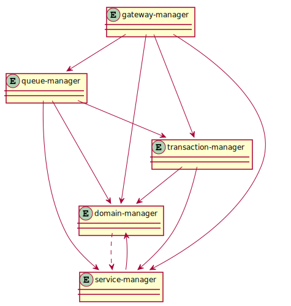

# components 

This section aims to provide an understanding of the fundamental _components_ of which `casual` consists.

Each component has a _manager_ that has the responsibility of the _component_

The following diagram illustrates all _managers_ and their relationships.

## domain-manager

Responsibilities:

* Start all other managers
* Hold domain configuration datastructure
* Start all user `servers` and `executables`
* `event` relay/dispatch
* Provide _pending message_ service for other _managers_
* Notify subscribers when _processes_ terminate/dies 

## service-manager 

Responsibilities:

* Service lookup repository 
* Any running process that has `services` will advertise these to `service-manager`

## transaction-manager

Responsibilities:

* Start all configured `resource proxies`
* Coordinate (distributed) transactions
* Act as a `resource` to other domains

## gateway-manager

Responsibilities:

* Listen to configured addresses and ports
* Start configured `outbound` connections
* Start `inbound` connections, when other domains connect with their `outbound`

### gateway-outbound 

* Forward messages to the other end (strict defined protocol)
* Act as a `resource` to `transaction-manager` _(if invocations are in transaction)_

## queue-manager

Responsibilities:

* Start all configured `queue-groups`
* Queue lookup

### queue-group 

* Provide configured queues
* Guaranteed transactional persistent messages _(if configured)_
* Act as a `resource` to transaction manager

