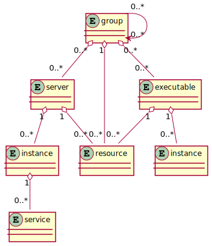

# user particles

This section aims to provide an overview of the fundamental user _particles_ of `casual` and their relationships.

That is, the entities that are involved from a user code perspective, during runtime.

## particles

The following diagram illustrates the relationship between the user particles 

### resource

* Configuration of a specific `resource`
* `servers` and `executables` uses this to "connect" to resources (if they're _built_ with a resource)

### group

* Groups `server` and `executables`. 
* Dependencies to other `groups`
* Determine the _boot_ and _shutdown_ ordering
* Has `0..*` `resources` _dependencies_, which give _members_ of the group _implicit dependencies_

### server

* _executable_ that `casual` can communicate whith, i.e. it has a _message pump_.
* Scales with `instances`
* Is a member of `0..*` `groups`.
* Has `0..*` explicit `resources` _dependencies_ 

### instance (server)

* Running process of a given `server`
* Advertises `0..*` `services`
* Is a member of `0..*` `groups`.

### executable 

* Arbitary _executable_
* `casual` communicates only with `SIGINT` to shutdown the _executable_
* Has `0..*` explicit `resources` _dependencies_ 

### instance (executable)

* Running process of a given `executable`

### service

* `XATMI` service
* _entry point_ for `0..*` `instances` (that could be from different `servers`)

