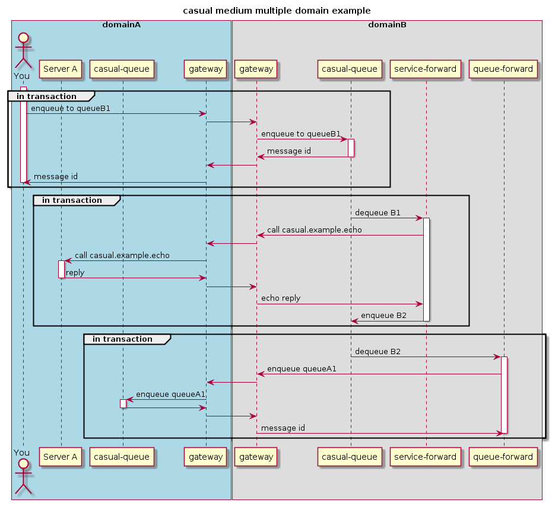

# medium multiple domain example

## objective

Explore the abillity of casual to discover resources in remote domains.

We'll set up two domains, **A** and **B**. From within **A** we'll enqueue a message to a queue in **B**. in **B**, a queue-service forward will dequeue the message and call a service in **A** and the reply is enqueued in another queue in **B**. in **B**, a queue-queue forward will dequeue the reply and enqueue it at a queue in **A**.
A queue service forward dequeue the message and call a service that will abort the transaction, hence the message is moved 
to the corresponding error queue.


### diagram

A simplified sequence diagram on what's going on (discovery and transaction related activity is omitted)




## pre requirements

see [domain example]( ../../readme.md)


## create domains

Create a directory where you want your domains to "live" 

*in production one probably wants to have a dedicated user for each domain and just use the "domain-user" home directory as the domain root*

The following will be used in this example.

```bash
host$ mkdir -p $HOME/casual/example/domain/multiple/medium
```
    
Copy the domains setup from the example:

```bash
host$ cp -r $CASUAL_HOME/example/domain/multiple/medium/* $HOME/casual/example/domain/multiple/medium/
```

### configuration

Each domain has it's configuration in `$CASUAL_DOMAIN_HOME/configuration/domain.yaml`. In our example these will be located at:

* `$HOME/casual/example/domain/multiple/medium/domainA/configuration/domain.yaml`
* `$HOME/casual/example/domain/multiple/medium/domainB/configuration/domain.yaml`

_The environment variable_ `CASUAL_DOMAIN_HOME` _is the only thing that dictate which domain you're using and working with_

 * [domainA/configuration/domain.yaml](domainA/configuration/domain.yaml)    
 * [domainB/configuration/domain.yaml](domainB/configuration/domain.yaml) 


If you chose another base directore for this example, please update the following files so they corresponds with your choice
 
 * [domainA/domain.env](domainA/domain.env)    
 * [domainB/domain.env](domainB/domain.env) 
 

## start domainA

In terminal A    

### prepare

Make sure we have the _few_ requered environment settings sourced.

You only have to do this once, of course.
 
```bash
host$ cd $HOME/casual/example/domain/multiple/medium/domainA
host:domainA$ source domain.env
```

### boot

We privide our configuration for the domain

```bash
host:domainA$ casual-admin domain --boot configuration/domain.yaml
``` 

    
## start domainB

In terminal B

### prepare

```bash
host$ cd $HOME/casual/example/domain/multiple/medium/domainB
host:domainB$ source domain.env
```
### boot

We privide our configuration for the domain

```bash
host:domainB$ casual-admin domain --boot configuration/domain.yaml
```


## interact with the setup


### current state

View current state in the two domains

#### domain A

List connections

```bash
host:domainA$ casual-admin gateway --list-connections
name               id                                bound  pid    queue    type  runlevel  address        
-----------------  --------------------------------  -----  -----  -------  ----  --------  ---------------
md-medium-domainB  b0cf47002d4642f7a72913d40cde6a92  out    22351  8060933  tcp   online    localhost:7772 
md-medium-domainB  b0cf47002d4642f7a72913d40cde6a92  in     22376   917521  tcp   online    localhost:64495
```

We have one inbound and one outbound connection to `domain B


List services
```bash
host:domainA$ casual-admin broker --list-services
name                     type  mode  timeout  invoked  local  load    avg T   tot pending #  avg pending T  remote                 
-----------------------  ----  ----  -------  -------  -----  ------  ------  -------------  -------------  ------ 
casual.example.echo         0  join   0.0000        0      1  0.0000  0.0000              0         0.0000       0 
casual.example.rollback     0  join   0.0000        0      1  0.0000  0.0000              0         0.0000       0 
casual.example.sink         0  join   0.0000        0      1  0.0000  0.0000              0         0.0000       0 
```


`casual.example.echo` and `casual.example.rollback` is advertised from one **local** instance, and no one has requested the services yet.


List queus
```bash
host:domainA$ casual-admin queue --list-queues
name                  count  size  avg  uc  updated                  r  error queue           group   
--------------------  -----  ----  ---  --  -----------------------  -  --------------------  --------
queueA1                   0     0    0   0  2016-11-20T15:17:34.068  0  queueA1.error         domain-A
queueA1.error             0     0    0   0  2016-11-20T15:17:34.068  0  domain-A.group.error  domain-A
domain-A.group.error      0     0    0   0  2016-11-20T15:17:34.062  0  domain-A.group.error  domain-A
```

#### domain B

List connections

```bash
host:domainB$ casual-admin gateway --list-connections
name               id                                bound  pid    queue   type  runlevel  address        
-----------------  --------------------------------  -----  -----  ------  ----  --------  ---------------
md-medium-domainA  653081bee12347029d207e8d131cd68f  out    22375  917517  tcp   online    localhost:7771 
md-medium-domainA  653081bee12347029d207e8d131cd68f  in     22377  720916  tcp   online    localhost:64496
```

We have one inbound and one outbound connection to `domain A


List services

```bash
host:domainB$ casual-admin broker --list-services
name                                  type  mode  timeout  requested  local  busy  pending  load   remote
------------------------------------  ----  ----  -------  ---------  -----  ----  -------  -----  ------
```


`casual.example.echo` is not yet known in this domain


List queus
```bash
host:domainB$ casual-admin queue --list-queues
name                  count  size  avg  uc  updated                  r  error queue           group   
--------------------  -----  ----  ---  --  -----------------------  -  --------------------  --------
queueB1                   0     0    0   0  2016-11-20T15:17:36.912  0  queueB1.error         domain-B
queueB2                   0     0    0   0  2016-11-20T15:17:36.914  0  queueB2.error         domain-B
queueB1.error             0     0    0   0  2016-11-20T15:17:36.912  0  domain-B.group.error  domain-B
queueB2.error             0     0    0   0  2016-11-20T15:17:36.914  0  domain-B.group.error  domain-B
domain-B.group.error      0     0    0   0  2016-11-20T15:17:36.904  0  domain-B.group.error  domain-B
```


### enqueue a message

In `domain A`, enqueue some characters to `queueB1` that is located in `domain B`

```bash
host:domainA$ echo "test" | casual-admin queue --enqueue queueB1
bec3b4b3cccd4f3b89faee970518ab7d
```

The message should be enqueued to `queueA1` and then dequeued and rollbacked, hence end up in `queueA1.error` pretty much directly

```bash
host:domainA$ casual-admin queue --list-queues
name                  count  size  avg  uc  updated                  r  error queue           group    
--------------------  -----  ----  ---  --  -----------------------  -  --------------------  --------
queueA1                   0     0    0   0  2016-12-17T14:45:13.119  0  queueA1.error         domain-A
queueA1.error             1     6    6   0  2016-12-17T14:42:53.620  0  domain-A.group.error  domain-A
domain-A.group.error      0     0    0   0  2016-12-17T14:42:53.614  0  domain-A.group.error  domain-A
```


The service `casual.example.echo` should be reqeusted once (the call from remote domain B).
The service `casual.example.rollback` should be reqeusted once from the forward in this domain.

```bash
host:domainA$ casual-admin broker --list-services
name                     type  mode  timeout  invoked  local  load    avg T   tot pending #  avg pending T  remote
-----------------------  ----  ----  -------  -------  -----  ------  ------  -------------  -------------  ------
casual.example.echo         0  join   0.0000        1      1  0.0000  0.0002              0         0.0000       0
casual.example.rollback     0  join   0.0000        1      1  0.0000  0.0002              0         0.0000       0
casual.example.sink         0  join   0.0000        0      1  0.0000  0.0000              0         0.0000       0
```


In `domain B`, `casual.example.echo` should be known with no local instances:

```bash
host:domainB$ casual-admin broker --list-services
name                 type  mode  timeout  invoked  local  load    avg T   tot pending #  avg pending T  remote
-------------------  ----  ----  -------  -------  -----  ------  ------  -------------  -------------  ------
casual.example.echo     0  join   0.0000        1      0  0.0000  0.0000              0         0.0000       1
```


