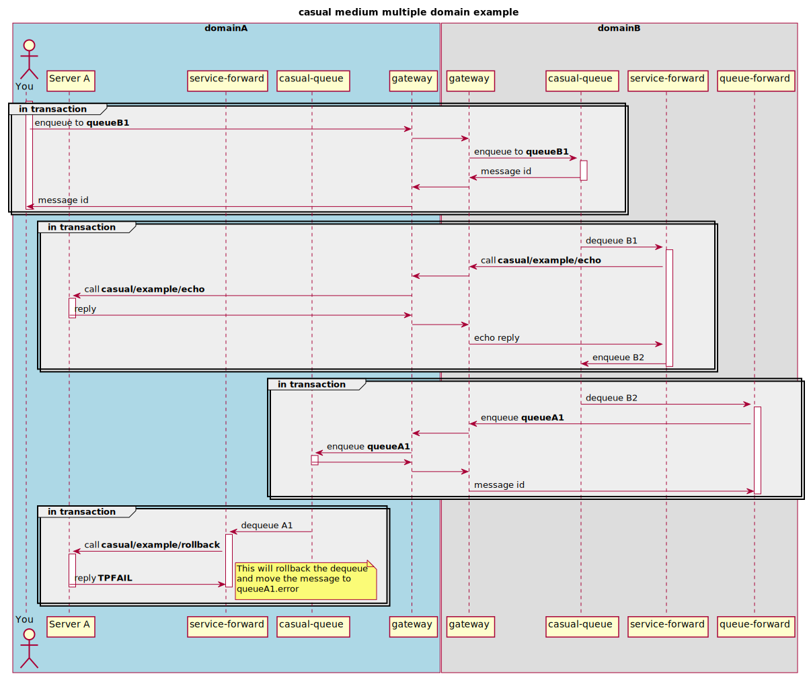

# medium multiple domain example

## objective

Explore the abillity of casual to discover resources in remote domains.

We'll set up two domains, **A** and **B**. 
* From within **A** we'll enqueue a message to a queue in **B**. 
* In **B**, a queue-service forward will dequeue the message and call a service in **A** and the reply is enqueued in another queue in **B**.
* in **B**, a queue-queue forward will dequeue the reply and enqueue it at a queue in **A**.
A queue service forward dequeues the message and calls a service that will abort the transaction, hence the message is moved 
to the corresponding error queue.


### diagram

A simplified sequence diagram on what's going on (discovery and transaction related activity is omitted)




## prerequisites

See [domain example]( ../../readme.md)


## create domains

Create a directory where you want your domains to "live".

**In production you probably want to have a dedicated user for each domain and just use the "domain-user" home directory as the domain root**

The following will be used in this example.

```bash
>$ mkdir -p $HOME/casual/example/domain/multiple/medium
```
    
Copy the domains setup from the example:

```bash
>$ cp -r $CASUAL_HOME/example/domain/multiple/medium/* $HOME/casual/example/domain/multiple/medium/
```

### configuration

Each domain has it's configuration in `$CASUAL_DOMAIN_HOME/configuration/domain.yaml`. In our example these will be located at:

* `$HOME/casual/example/domain/multiple/medium/domainA/configuration/domain.yaml`
* `$HOME/casual/example/domain/multiple/medium/domainB/configuration/domain.yaml`

_The environment variable_ `CASUAL_DOMAIN_HOME` _is the only thing that dictates which domain you're using and working with_

 * [domainA/configuration/domain.yaml](domainA/configuration/domain.yaml)    
 * [domainB/configuration/domain.yaml](domainB/configuration/domain.yaml) 


If you chose another base directore for this example, please update the following files so they corresponds with your choice
 
 * [domainA/domain.env](domainA/domain.env)    
 * [domainB/domain.env](domainB/domain.env) 
 

## start domainA

In the terminal for domainA.   

### prepare

Make sure the required environment settings are sourced.

*You only have to do this once.*
 
```bash
domainA>$ cd $HOME/casual/example/domain/multiple/medium/domainA
domainA>$ source domain.env
```

### boot

We provide our configuration for the domain:

```bash
domainA>$ casual domain --boot configuration/domain.yaml
``` 

    
## start domainB

In the terminal for domainB.

### prepare

```bash
domainB>$ cd $HOME/casual/example/domain/multiple/medium/domainB
domainB>$ source domain.env
```
### boot

We provide our configuration for the domain:

```bash
domainB>$ casual domain --boot configuration/domain.yaml
```


## interact with the setup


### current state

View current state in the two domains.

#### domain A

List connections:

```bash
domainA>$ casual gateway --list-connections
name               id                                bound  pid    queue    type  runlevel  address        
-----------------  --------------------------------  -----  -----  -------  ----  --------  ---------------
md-medium-domainB  b0cf47002d4642f7a72913d40cde6a92  out    22351  8060933  tcp   online    localhost:7772 
md-medium-domainB  b0cf47002d4642f7a72913d40cde6a92  in     22376   917521  tcp   online    localhost:64495
```

We have one inbound and one outbound connection to `domainB`.


List services:

```bash
domainA>$ casual service --list-services
name                         category  mode  timeout   I  C  AT        P  PAT       RI  RC  last                   
---------------------------  --------  ----  --------  -  -  --------  -  --------  --  --  -----------------------
casual/example/conversation  example   join  0.000000  1  0  0.000000  0  0.000000   0   0  0000-00-00T00:00:00.000
casual/example/echo          example   join  0.000000  1  0  0.000000  0  0.000000   0   0  2018-04-11T22:54:02.185
casual/example/lowercase     example   join  0.000000  1  0  0.000000  0  0.000000   0   0  0000-00-00T00:00:00.000
casual/example/rollback      example   join  0.000000  1  0  0.000000  0  0.000000   0   0  2018-04-11T22:54:02.197
casual/example/sink          example   join  0.000000  1  0  0.000000  0  0.000000   0   0  0000-00-00T00:00:00.000
casual/example/sleep         example   join  0.000000  1  0  0.000000  0  0.000000   0   0  0000-00-00T00:00:00.000
casual/example/terminate     example   join  0.000000  1  0  0.000000  0  0.000000   0   0  0000-00-00T00:00:00.000
casual/example/uppercase     example   join  0.000000  1  0  0.000000  0  0.000000   0   0  0000-00-00T00:00:00.000
casual/example/work          example   join  0.000000  1  0  0.000000  0  0.000000   0   0  0000-00-00T00:00:00.000
```


`casual/example/echo` and `casual/example/rollback` is advertised from one **local** instance, and no one has requested the services yet.


List queues:

```bash
domainA>$ casual queue --list-queues 
name                  count  size  avg  uc  updated                  r  t  group   
--------------------  -----  ----  ---  --  -----------------------  -  -  --------
queueA1                   0     0    0   0  2018-04-11T23:03:47.853  0  q  domain-A
queueA1.error             0     0    0   0  2018-04-11T23:03:47.853  0  e  domain-A
domain-A.group.error      0     0    0   0  2018-04-11T23:03:47.848  0  g  domain-A
```

#### domain B

List connections:

```bash
domainB>$ casual gateway --list-connections 
name               id                                bound  pid    queue     type  runlevel  address        
-----------------  --------------------------------  -----  -----  --------  ----  --------  ---------------
md-medium-domainA  0e483f8393da4ebc8da6978a07493213  out    17509  13828096  tcp   online    localhost:7771 
md-medium-domainA  0e483f8393da4ebc8da6978a07493213  in     17522    655380  tcp   online    localhost:51175
```

We have one inbound and one outbound connection to `domainA`.


List services:

```bash
domainB>$ casual service --list-services
name  category  mode  timeout  I  C  AT  P  PAT  RI  RC  last
----  --------  ----  -------  -  -  --  -  ---  --  --  ----
```


`casual/example/echo` is not yet known in this domain.


List queues:

```bash
domainB>$ casual queue --list-queues 
name                  count  size  avg  uc  updated                  r  t  group   
--------------------  -----  ----  ---  --  -----------------------  -  -  --------
queueB1                   0     0    0   0  2018-04-11T23:06:15.916  0  q  domain-B
queueB1.error             0     0    0   0  2018-04-11T23:06:15.916  0  e  domain-B
queueB2                   0     0    0   0  2018-04-11T23:06:15.918  0  q  domain-B
queueB2.error             0     0    0   0  2018-04-11T23:06:15.918  0  e  domain-B
domain-B.group.error      0     0    0   0  2018-04-11T23:06:15.910  0  g  domain-B
```


### enqueue a message

In `domainA`, enqueue some characters to `queueB1` that is located in `domainB`

```bash
domainA>$ echo "test" | casual queue --enqueue queueB1
bec3b4b3cccd4f3b89faee970518ab7d
```

The message should be enqueued to `queueA1` and then dequeued and rollbacked, hence end up in `queueA1.error` pretty much directly.

```bash
domainA>$ casual queue --list-queues 
name                  count  size  avg  uc  updated                  r  t  group   
--------------------  -----  ----  ---  --  -----------------------  -  -  --------
queueA1                   0     0    0   0  2018-04-11T23:07:25.602  0  q  domain-A
queueA1.error             1     6    6   0  2018-04-11T23:03:47.853  0  e  domain-A
domain-A.group.error      0     0    0   0  2018-04-11T23:03:47.848  0  g  domain-A
```


The service `casual/example/echo` should be reqeusted once (the call from remote `domainB`).
The service `casual/example/rollback` should be reqeusted once from the forward in this domain.

```bash
domainA>$ casual service --list-services
name                         category  mode  timeout   I  C  AT        P  PAT       RI  RC  last                   
---------------------------  --------  ----  --------  -  -  --------  -  --------  --  --  -----------------------
casual/example/conversation  example   join  0.000000  1  0  0.000000  0  0.000000   0   0  0000-00-00T00:00:00.000
casual/example/echo          example   join  0.000000  1  1  0.001463  0  0.000000   0   0  2018-04-11T23:07:25.593
casual/example/lowercase     example   join  0.000000  1  0  0.000000  0  0.000000   0   0  0000-00-00T00:00:00.000
casual/example/rollback      example   join  0.000000  1  1  0.001282  0  0.000000   0   0  2018-04-11T23:07:25.608
casual/example/sink          example   join  0.000000  1  0  0.000000  0  0.000000   0   0  0000-00-00T00:00:00.000
casual/example/sleep         example   join  0.000000  1  0  0.000000  0  0.000000   0   0  0000-00-00T00:00:00.000
casual/example/terminate     example   join  0.000000  1  0  0.000000  0  0.000000   0   0  0000-00-00T00:00:00.000
casual/example/uppercase     example   join  0.000000  1  0  0.000000  0  0.000000   0   0  0000-00-00T00:00:00.000
casual/example/work          example   join  0.000000  1  0  0.000000  0  0.000000   0   0  0000-00-00T00:00:00.000
```


In `domainB`, `casual/example/echo` should be known with no local instances:

```bash
domainB>$ casual service --list-services
name                 category  mode  timeout   I  C  AT        P  PAT       RI  RC  last                   
-------------------  --------  ----  --------  -  -  --------  -  --------  --  --  -----------------------
casual/example/echo  example   join  0.000000  0  0  0.000000  0  0.000000   1   1  0000-00-00T00:00:00.000
```


