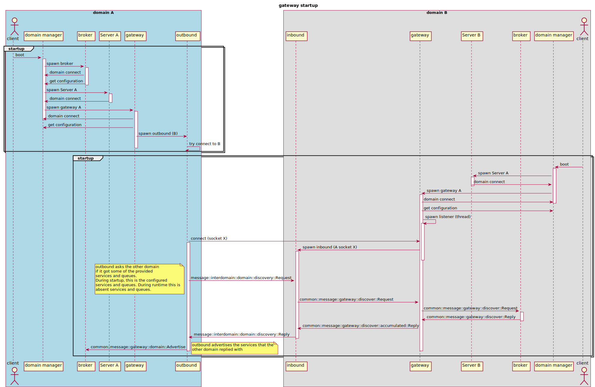
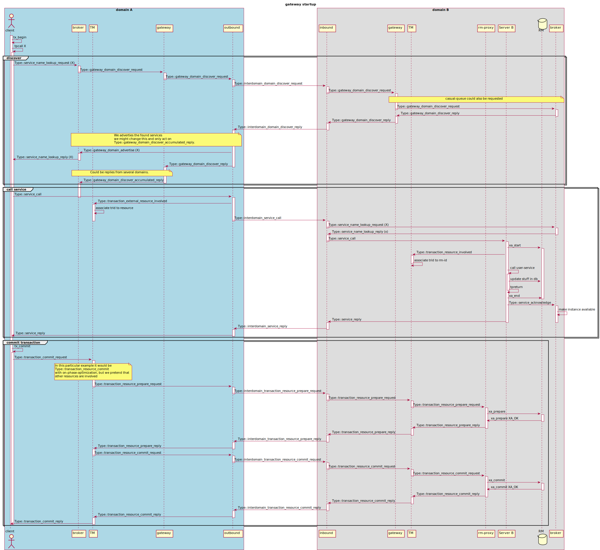

# interdomain semantics

Aims to try to give an overview on how the communication works between `casual` domains

## startup

The following diagram illustrates the startup procedure

## call absent service

The following diagram illustrates how an absent service is discovered
and then called. Followed by a commit

