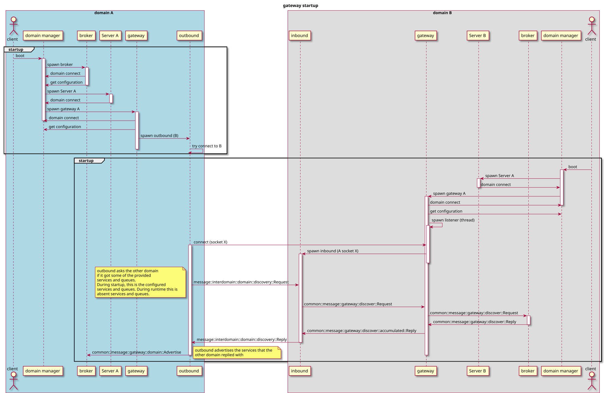
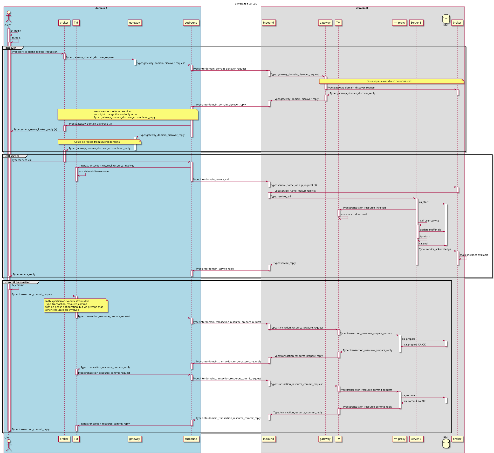

# interdomain semantics

Aims to try to give an overview on how the communication works between `casual` domains


## startup

The following diagram illustrates the startup procedure




## call absent service

The following diagram illustrates how an absent service is discovered
and then called. Followed by a commit





## outbound connection disassociation

When an outbound gateway connection is about to disconnect (explicit disconnect)
or is already lost, outbound initiates a disassociation flow before the
connection is removed.

### trigger

- explicit domain disconnect request
- lost TCP connection event

### semantics and ordering

1. The connection is marked as pending disassociation.
2. Discovery registration for the connection is removed first, to prevent new
	discovery-related traffic from being routed to this connection.
3. A disassociate request is sent to SM (service manager).
4. A disassociate request is sent to QM (queue manager) if QM is online.
5. If QM is offline, QM is treated as already done for this flow.
6. TM (transaction manager) is not contacted immediately.
7. TM disassociate is sent only after SM is done and QM is done (or QM is
	offline).

The delayed TM request is intentional. It avoids a race where TM would
disassociate the external resource before SM/QM have finished draining or
accounting for pending work that can still arrive during the disconnect window.

### ascii flow

```text
Actors:
   Outbound = gateway outbound connection handler
   D        = discovery
   SM       = service manager
   QM       = queue manager
   TM       = transaction manager

Trigger: disconnect requested OR connection lost

Outbound                     D         SM          QM          TM
    |                        |          |           |           |
    | mark pending dissociate|          |           |           |
    | unregister discovery   |          |           |           |
    |----------------------->|          |           |           |
    |<-----------------------|          |           |           |
    | disassociate request   |          |           |           |
    |---------------------------------->|           |           |
    | disassociate request              |           |           |
    |---------------------------------------------->|           |
    |<----------------------------------|           |           |
    |<----------------------------------------------|           |
    |                                                           |
    | if SM done and (QM done or QM offline):                   |
    |                        disassociate request               |
    |---------------------------------------------------------->|
    |<----------------------------------------------------------|
    |
    | disconnect reply to remote inbound (if this flow was initiated 
    |    by a remote disconnect request)
    | emit ipc::Destroyed event
    | remove connection + cleanup tasks
    | reconnect (if lost or remote disconnect was requested)
    v
 done

Alternative QM offline path:
	- send to optional QM endpoint fails
	- mark QM as done immediately
	- wait only for SM reply before sending TM disassociate request
```

### completion

1. Outbound waits for the TM disassociate reply.
2. Optional external disconnect reply is sent back (if this flow was initiated
	by a remote disconnect request).
3. An IPC destroyed event is emitted so other managers can clean associated
	state.
4. The connection is removed from outbound state.
5. Pending tasks for the descriptor are failed/cleaned.
6. If directive is reconnect, a reconnect message is scheduled; otherwise the
	connection is removed permanently.

### practical effect

- New internal requests targeting the connection while it is in pending
  disassociation are short-circuited with default error replies.
- The connection is removed only after manager-level disassociation has been
  acknowledged in the required order.


